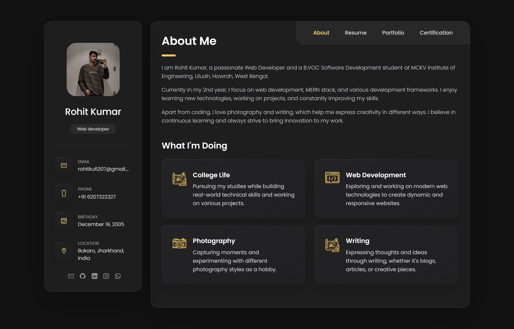
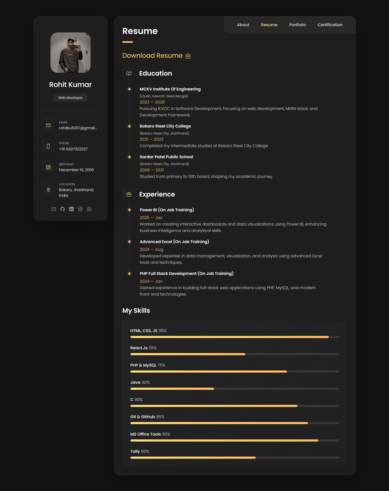
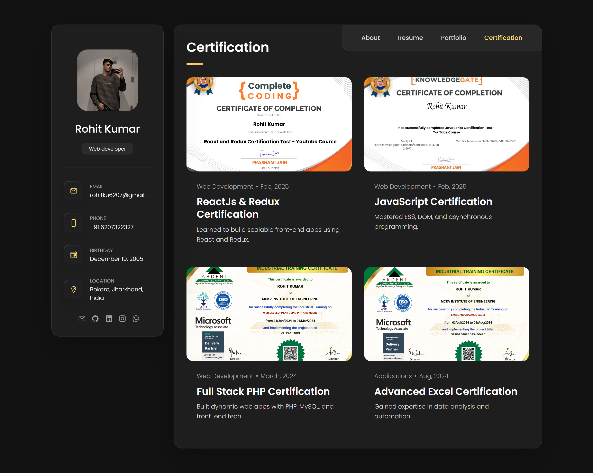

# 🚀 Rohit Kumar Saw — Personal Portfolio

Welcome to my personal portfolio website!  
This portfolio highlights my **skills**, **projects**, **certifications**, and **resume** with a clean, modern, and responsive design.

🌐 **Live Site:** [https://rohitsaw6207.github.io/Rohit-Personal-Portfolio/](https://rohitsaw6207.github.io/Rohit-Personal-Portfolio/)

---

## 📌 Sections

- 🧑‍💻 **About**  
  An introduction about me, my passion for technology, and my journey so far.

- 📄 **Resume**  
  Details of my experience, skills, and education.

- 🗂️ **Portfolio**  
  A showcase of projects I have worked on.

- 🏅 **Certification**  
  My professional certifications and achievements.

---

## 🖼️ Preview

| Home | About | Portfolio | Certification |
|:--:|:--:|:--:|:--:|
|  |  |  |  |

---

## 🛠️ Built With

- **HTML5**
- **CSS3**
- **JavaScript**
- **GitHub Pages** (for deployment)

---

## 🚀 Deployment

The website is hosted via **GitHub Pages**.

---

## 🧑‍💻 Author

- **Rohit Kumar Saw**  
- 📧 [rohitku6207@gmail.com](mailto:rohitku6207@gmail.com)  
- 🔗 [LinkedIn](https://www.linkedin.com/in/rohit-kumar-saw6207/)  
- 💻 [GitHub](https://github.com/Rohitsaw6207)

---

## ⭐ Support

If you like this project, consider starring ⭐ the repository to support and inspire more work!
